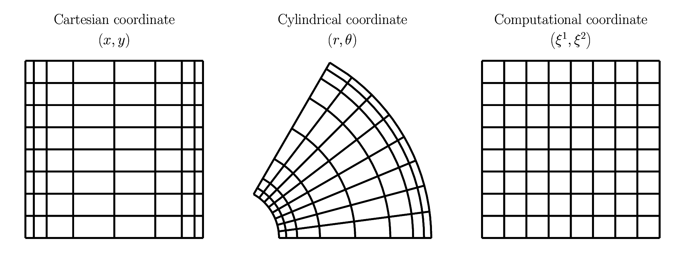

.. _equation:

########
Equation
########

.. include:: /reference/reference.txt

******************
Boundary condition
******************

We focus on Cartesian (:math:`\vx,\vy,\vz`) and cylindrical (:math:`\vr,\vt,\vz`) domains which satisfy the following conditions.

* :math:`\vx, \vr` directions are wall-bounded and impermeable condition is imposed.
* :math:`\vy, \vt` directions are stream-wise, to which the walls may move with constant speeds over time and periodic boundary condition is imposed.
* :math:`\vz` direction is span-wise, to which the walls do not move and periodic boundary condition is imposed.

******
Metric
******

For simplicity and generality, the governing equations are written in a general rectilinear coordinate system :math:`\gcs{i}` with normalised components :math:`\vel{i}` (c.f., |MORINISHI2004|).
:math:`\sfact{i}` denote scale factors and its product is the Jacobian determinant :math:`J` due to the orthogonality.

There are several terms which are characteristic of cylindrical coordinates.
In Cartesian coordinates, these additional terms lead to zero since :math:`\sfact{2}, \sfact{3}` do not change in :math:`\gcs{1}`.
Thus all equations, their numerical descriptions, and implementations can be unified.

See :ref:`e.g., the appendix <appendix>` for the derivations.

*******************
Shear-stress tensor
*******************

We define a second-order tensor representing the gradient of velocity vector:

.. math::

    \sum_i
    \sum_j
    \vec{e}_i
    \otimes
    \vec{e}_j
    \vgt{i}{j},

where the components :math:`\vgt{i}{j}` are

.. math::

    \begin{pmatrix}
        \vgt{1}{1} & \vgt{2}{1} & \vgt{3}{1} \\
        \vgt{1}{2} & \vgt{2}{2} & \vgt{3}{2} \\
        \vgt{1}{3} & \vgt{2}{3} & \vgt{3}{3} \\
    \end{pmatrix}
    =
    \begin{pmatrix}
        \frac{1}{\sfact{1}}
        \pder{\vel{1}}{\gcs{1}}
        &
        \frac{1}{\sfact{2}}
        \pder{\vel{1}}{\gcs{2}}
        -
        \frac{1}{J}
        \pder{}{\gcs{1}}
        \left(
            \frac{J}{\sfact{1}}
        \right)
        \vel{2}
        &
        \frac{1}{\sfact{3}}
        \pder{\vel{1}}{\gcs{3}}
        \\
        \frac{1}{\sfact{1}}
        \pder{\vel{2}}{\gcs{1}}
        &
        \frac{1}{\sfact{2}}
        \pder{\vel{2}}{\gcs{2}}
        +
        \frac{1}{J}
        \pder{}{\gcs{1}}
        \left(
            \frac{J}{\sfact{1}}
        \right)
        \vel{1}
        &
        \frac{1}{\sfact{3}}
        \pder{\vel{2}}{\gcs{3}}
        \\
        \frac{1}{\sfact{1}}
        \pder{\vel{3}}{\gcs{1}}
        &
        \frac{1}{\sfact{2}}
        \pder{\vel{3}}{\gcs{2}}
        &
        \frac{1}{\sfact{3}}
        \pder{\vel{3}}{\gcs{3}}
    \end{pmatrix}.

The shear-stress tensor for Newtonian liquids is defined using the symmetric part of :math:`\vgt{i}{j}`:

.. math::

    \sst{i}{j}
    \equiv
    \mu
    \vgt{i}{j}
    +
    \mu
    \vgt{j}{i}.

Viscous contribution on the momentum balance is given by the divergence of this tensor:

.. math::

    \pder{}{x_j}
    \left(
        \mu
        \vgt{i}{j}
        +
        \mu
        \vgt{j}{i}
    \right).

Note that we assume :math:`\mu` is constant in this project to obtain

.. math::

    \mu
    \pder{}{x_j}
    \left(
        \vgt{j}{i}
        +
        \vgt{i}{j}
    \right).

Hereafter we use kinematic viscosity :math:`\nu \equiv \mu / \rho`, since we assume the density :math:`\rho` is constant as well.

****************************
Incompressibility constraint
****************************

.. math::

    \frac{1}{J}
    \pder{}{\gcs{1}}
    \left(
        \frac{J}{\sfact{1}} \vel{1}
    \right)
    +
    \frac{1}{J}
    \pder{}{\gcs{2}}
    \left(
        \frac{J}{\sfact{2}} \vel{2}
    \right)
    +
    \frac{1}{J}
    \pder{}{\gcs{3}}
    \left(
        \frac{J}{\sfact{3}} \vel{3}
    \right)
    =
    0.

****************
Momentum balance
****************

.. math::

    \momtemp{1}
    =
    &
    \momadv{1}{1}
    \momadv{2}{1}
    \momadv{3}{1}

    &
    \momadvx

    &
    \mompre{1}

    &
    \momdif{1}{1}
    \momdif{2}{1}
    \momdif{3}{1}

    &
    \momdifx

    &
    +
    a_1,

.. math::

    \momtemp{2}
    =
    &
    \momadv{1}{2}
    \momadv{2}{2}
    \momadv{3}{2}

    &
    \momadvy

    &
    \mompre{2}

    &
    \momdif{1}{2}
    \momdif{2}{2}
    \momdif{3}{2}

    &
    \momdify,

.. math::

    \momtemp{3}
    =
    &
    \momadv{1}{3}
    \momadv{2}{3}
    \momadv{3}{3}

    &
    \mompre{3}

    &
    \momdif{1}{3}
    \momdif{2}{3}
    \momdif{3}{3}.

Note that :math:`a_1` is the wall-normal acceleration term, which is to reflect the effects of scalar on the momentum balance (e.g., buoyancy force under Boussinesq approximation for Rayleigh-Bénard flows).

****************
Scalar transport
****************

.. math::

    \scalartemp
    =
    &
    \scalaradv{1}
    \scalaradv{2}
    \scalaradv{3}

    &
    \scalardif{1}
    \scalardif{2}
    \scalardif{3},

where :math:`\kappa` is the diffusivity of the scalar.

******************
Quadratic quantity
******************

We consider the quadratic quantities with respect to the velocity field:

.. math::

    \quad{i}
    \equiv
    \frac{1}{2}
    \vel{i} \vel{i}
    \,\,
    \left(
        \text{
            No summation over
        }
        \,
        i
    \right),

which are obtained by multiplying each momentum balance by the corresponding velocity.
By volume-integrating the relations inside the whole domain and summing them up, we obtain the relation of the net kinetic energy:

.. math::

    \pder{}{t}
    \int
    \int
    \int
    \left(
        \quad{1}
        +
        \quad{2}
        +
        \quad{3}
    \right)
    J
    d\gcs{1}
    d\gcs{2}
    d\gcs{3}
    =
    \left( \text{input} \right)
    +
    \left( \text{transport} \right)
    +
    \left( \text{dissipation} \right).

Input is the energy input due to the acceleration force and leads to

.. math::

    \int
    \int
    \int
    J
    \vel{1}
    a_1
    d\gcs{1}
    d\gcs{2}
    d\gcs{3}.

There are two more terms on the right-hand side, which originate from the diffusive terms in the momentum balance relations.
The advective and pressure-gradient contributions on the global energy balance vanish due to the prescribed boundary conditions.

Here the *transport* is the net kinetic energy going through the walls which attributes to the wall-normal diffusive term in the stream-wise momentum equation:

.. math::

    -
    \int
    \int
    \vat{
        \left(
            \frac{J}{\sfact{1}}
            \vel{2}
            \sst{1}{2}
        \right)
    }{\text{Negative wall}}
    d\gcs{2}
    d\gcs{3}
    +
    \int
    \int
    \vat{
        \left(
            \frac{J}{\sfact{1}}
            \vel{2}
            \sst{1}{2}
        \right)
    }{\text{Positive wall}}
    d\gcs{2}
    d\gcs{3},

while the *dissipation* is handled by the other terms

.. math::

    &
    -
    \int
    \int
    \int
    \left[
        \begin{aligned}
            &
            +
            \frac{1}{\sfact{1}}
            \pder{\vel{1}}{\gcs{1}}
            \sst{1}{1}
            +
            \left\{
                \frac{1}{\sfact{2}}
                \pder{\vel{1}}{\gcs{2}}
                -
                \frac{1}{J}
                \pder{}{\gcs{1}}
                \left(
                    \frac{J}{\sfact{1}}
                \right)
                \vel{2}
            \right\}
            \sst{2}{1}
            +
            \frac{1}{\sfact{3}}
            \pder{\vel{1}}{\gcs{3}}
            \sst{3}{1} \\
            &
            +
            \frac{1}{\sfact{1}}
            \pder{\vel{2}}{\gcs{1}}
            \sst{1}{2}
            +
            \left\{
                \frac{1}{\sfact{2}}
                \pder{\vel{2}}{\gcs{2}}
                +
                \frac{1}{J}
                \pder{}{\gcs{1}}
                \left(
                    \frac{J}{\sfact{1}}
                \right)
                \vel{1}
            \right\}
            \sst{2}{2}
            +
            \frac{1}{\sfact{3}}
            \pder{\vel{2}}{\gcs{3}}
            \sst{3}{2} \\
            &
            +
            \frac{1}{\sfact{1}}
            \pder{\vel{3}}{\gcs{1}}
            \sst{1}{3}
            +
            \frac{1}{\sfact{2}}
            \pder{\vel{3}}{\gcs{2}}
            \sst{2}{3}
            +
            \frac{1}{\sfact{3}}
            \pder{\vel{3}}{\gcs{3}}
            \sst{3}{3}
        \end{aligned}
    \right]
    J
    d\gcs{1}
    d\gcs{2}
    d\gcs{3} \\
    &
    = \\
    &
    -
    \int
    \int
    \int
    \left(
        \begin{aligned}
            &
            +
            \vgt{1}{1}
            \sst{1}{1}
            +
            \vgt{2}{1}
            \sst{2}{1}
            +
            \vgt{3}{1}
            \sst{3}{1} \\
            &
            +
            \vgt{1}{2}
            \sst{1}{2}
            +
            \vgt{2}{2}
            \sst{2}{2}
            +
            \vgt{3}{2}
            \sst{3}{2} \\
            &
            +
            \vgt{1}{3}
            \sst{1}{3}
            +
            \vgt{2}{3}
            \sst{2}{3}
            +
            \vgt{3}{3}
            \sst{3}{3}
        \end{aligned}
    \right)
    J
    d\gcs{1}
    d\gcs{2}
    d\gcs{3}.

Similarly we consider a quadratic quantity with respect to the scalar field:

.. math::

    q
    \equiv
    \frac{1}{2}
    T T,

following

.. math::

    \pder{}{t}
    \int
    \int
    \int
    J
    d\gcs{1}
    d\gcs{2}
    d\gcs{3}
    =
    \left( \text{transport} \right)
    +
    \left( \text{dissipation} \right).

Again the *transport* is the net scalar quadratic quantity going through the walls:

.. math::

    -
    \int
    \int
    \vat{
        \kappa
        \left(
            \frac{J}{\sfact{1}}
            T
            \frac{1}{\sfact{1}}
            \pder{T}{\gcs{1}}
        \right)
    }{\text{Negative wall}}
    d\gcs{2}
    d\gcs{3}
    +
    \int
    \int
    \vat{
        \kappa
        \left(
            \frac{J}{\sfact{1}}
            T
            \frac{1}{\sfact{1}}
            \pder{T}{\gcs{1}}
        \right)
    }{\text{Positive wall}}
    d\gcs{2}
    d\gcs{3},

while the *dissipation* is

.. math::

    -
    \int
    \int
    \int
    \left(
        \kappa
        \frac{1}{\sfact{1}}
        \pder{T}{\gcs{1}}
        \frac{1}{\sfact{1}}
        \pder{T}{\gcs{1}}
        +
        \kappa
        \frac{1}{\sfact{2}}
        \pder{T}{\gcs{2}}
        \frac{1}{\sfact{2}}
        \pder{T}{\gcs{2}}
        +
        \kappa
        \frac{1}{\sfact{3}}
        \pder{T}{\gcs{3}}
        \frac{1}{\sfact{3}}
        \pder{T}{\gcs{3}}
    \right)
    J
    d\gcs{1}
    d\gcs{2}
    d\gcs{3}.

